# BOT5 Club Assistant Bot Plugin

[](https://www.npmjs.com/package/wechaty-bot5-assistant)
[](https://github.com/wechaty/bot5-assistant/actions?query=workflow%3ANPM)
[](https://github.com/Wechaty/wechaty)

BOT5 Meeting Assistant BOT powered by RSVP.ai & Wechaty & XState.

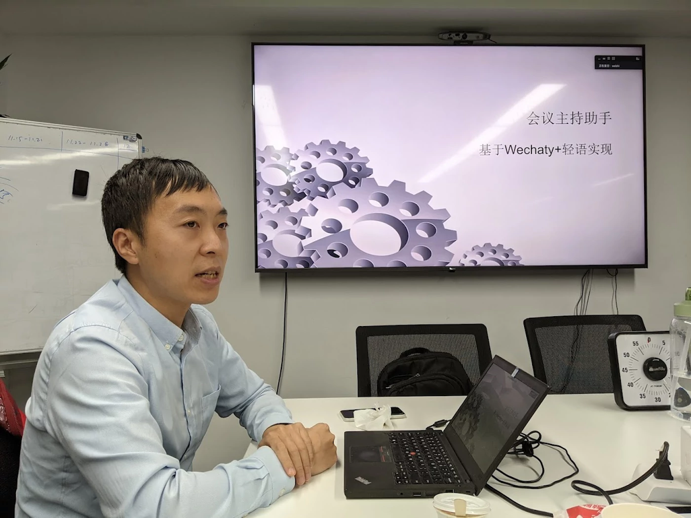

> Blog post: [基于Wechaty+轻语实现会议主持助手，崔安颀，Oct 29, 2021, BOT5 Club](https://bot5.ml/events/seminar-minutes-2021-08/#1--%E4%BC%9A%E8%AE%AE%E4%B8%BB%E6%8C%81%E5%8A%A9%E6%89%8B%E6%9C%BA%E5%99%A8%E4%BA%BA)

## BOT5 Club Seminar Flow Chart

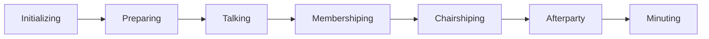

### 0. Initializing

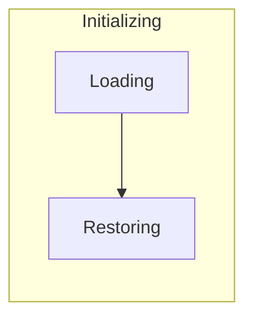

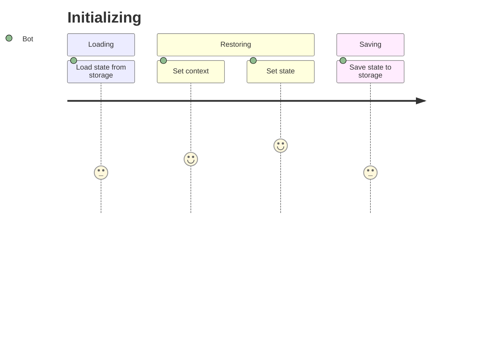

### 1. Preparing

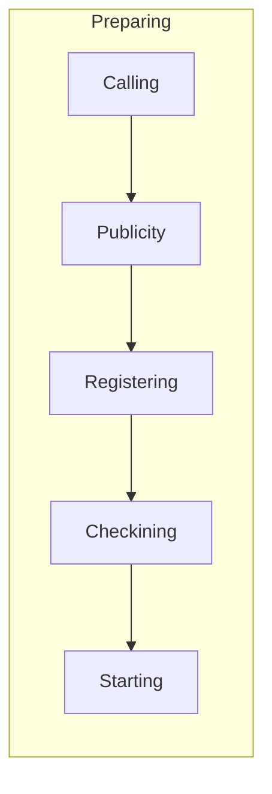

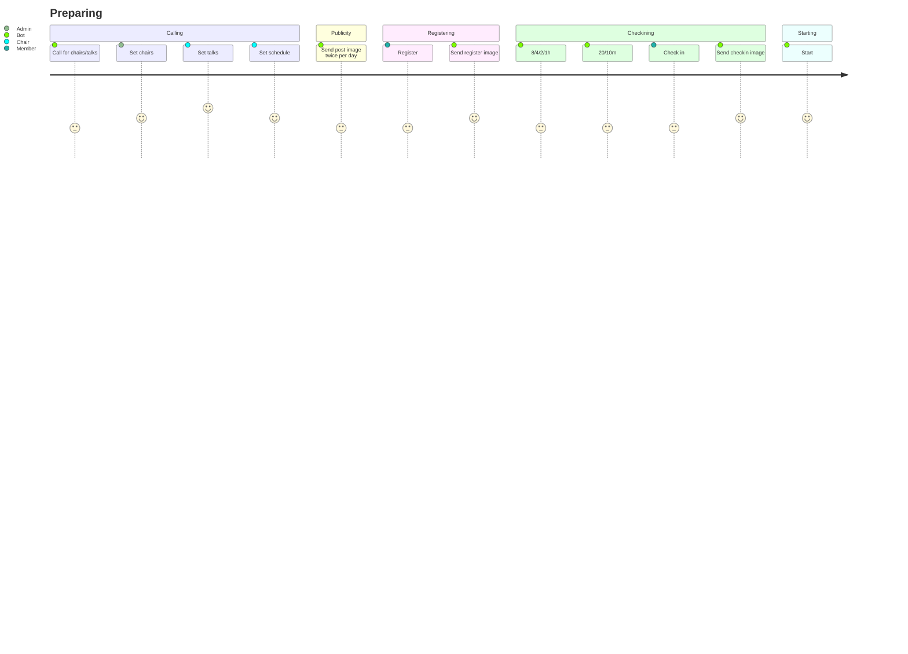

### 2. Talking

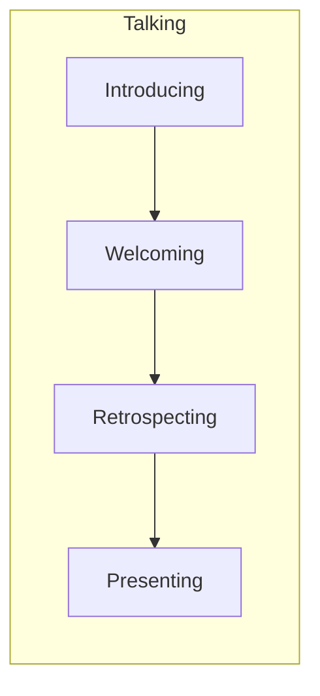

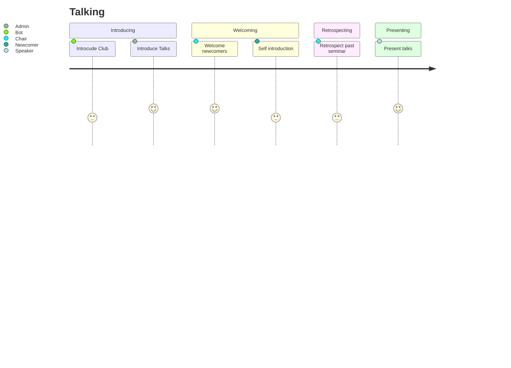

### 3. Membershiping

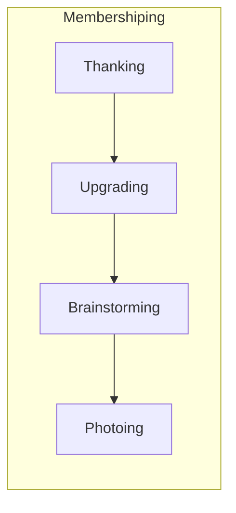

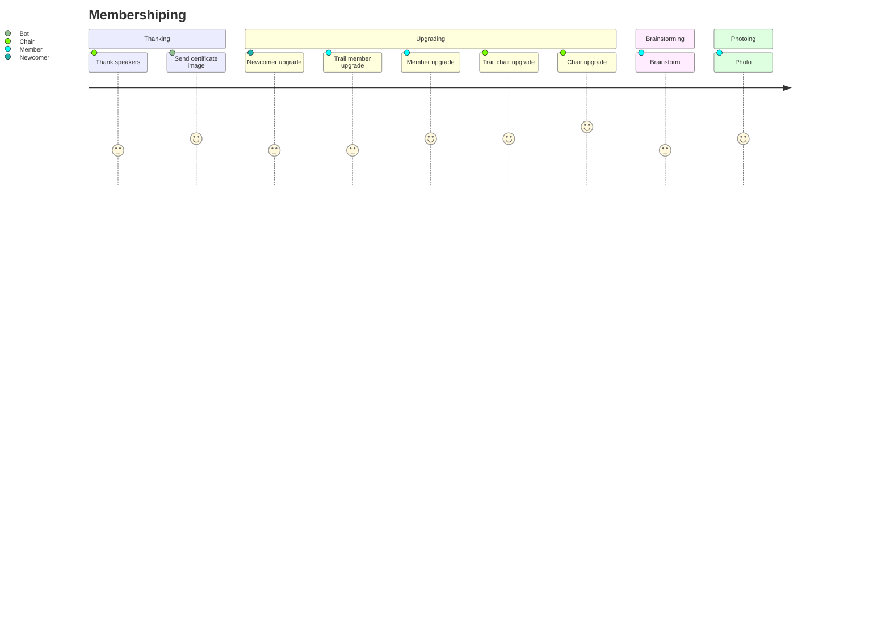

### 4. Chairshiping

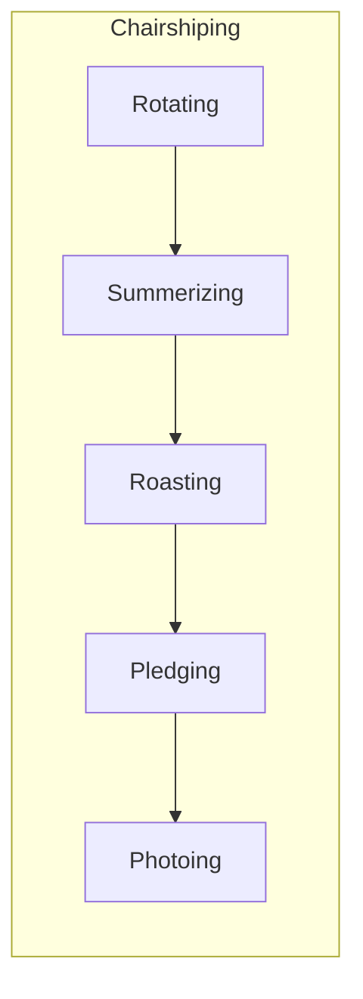

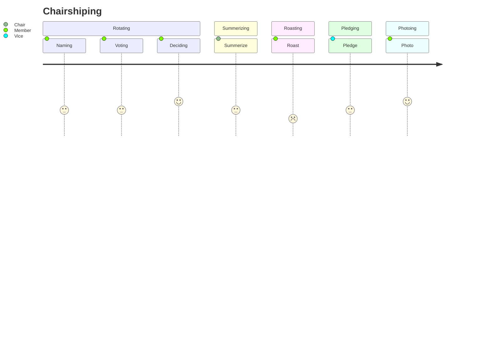

### 5. Afterparty

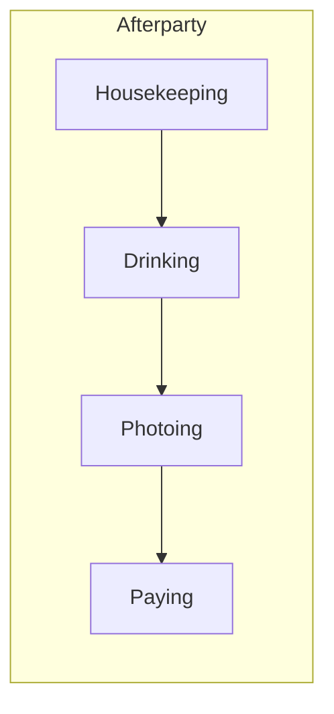

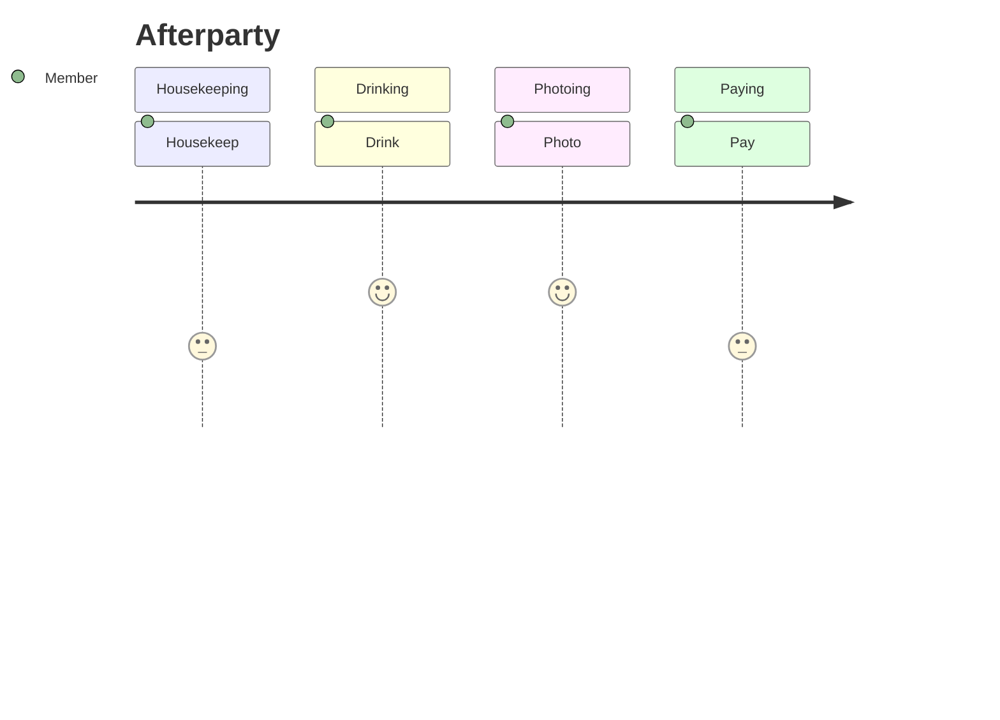

### 6. Minuting

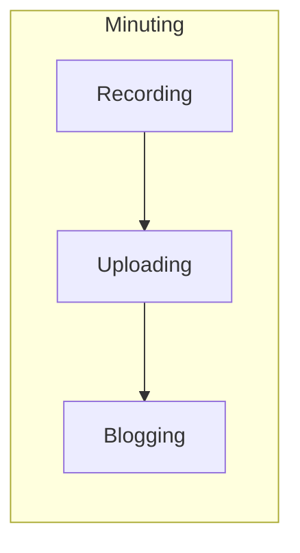

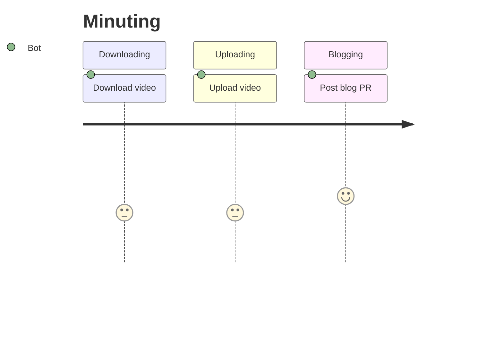

See also: [BOT5 Club Chair Manual](http://bot5.ml/manuals/chair/)

## Getting Started

### Step 1: Install

```sh
npm install wechaty-bot5-assistant --save
```

### Step 2: Make a bot

```sh
$ vim mybot.js

import { WechatyBuilder } from 'wechaty'
import { Bot5Assistant } from 'wechaty-bot5-assistant'

const bot = WechatyBuilder.build()

bot.use(Bot5Assistant({
  room: [
    /^BOT5/,
  ]
}))
.on('scan', (url, code) => console.log(`Scan QR Code to login: ${code}\n${url}`))
.on('login', user => console.log(`User ${user} logged in`))
.start()
```

### Step 3: Run

```sh
node mybot.js
```

## Options

```ts
const DEFAULT_CONFIG = {
  // Which room(s) you want the bot to work with.
  // Can be a RegExp (for topic) or a function (filter room instance)
  // E.g. room: function (room) { room.topic().indexOf('我的') > -1 }
  room: [/BOT5/i, 'room_id@chatroom'],
}
```

## RSVP.ai

RSVP.ai is a machine-learning company that provides deep natural language understanding services for conversation-styled applications. It grew out of a collaboration between Tsinghua University and University of Waterloo.

RSVP.ai is a small and dedicated team making the smart machines today become the thinking machines tomorrow.

## Finate State Machine (FSM)

It's a finite state machine, which means it has a finite number of states.

> Huan(202110): the above line is auto generated by GitHub Pilot.

We are trying to use [XState](https://xstate.js.org/) to implement the FSM and using FSM to manage our meeting state transitions.

Currently we are just getting started, you can learn more about the BOT5 Club Meeting FSM at <https://wechaty.github.io/bot5-assistant/>

## Resources

### Projects

- [Dialogs modeled as finite state machines, Giorgio Robino, Jul 14, 2016](https://solyarisoftware.medium.com/dialoghi-come-macchine-a-stati-41bb748fd5b0)

### Papers

- [Dialog Management for Credit Card Selling via Finite State Machine Using Sentiment Classification in Turkish Language, Gizem Sogancıo ˘ glu et. al., INTELLI 2017 : The Sixth International Conference on Intelligent Systems and Applications (includes InManEnt)](https://www.thinkmind.org/articles/intelli_2017_2_30_60066.pdf)
- [State Machine Based Human-Bot Conversation Model and Services, Shayan Zamanirad et. al., May 9, 2020, CAiSE 2020](https://www.semanticscholar.org/paper/State-Machine-Based-Human-Bot-Conversation-Model-Zamanirad-Benatallah/ffa524c4e247a9f532ea4ddb6407be0c9cc8d301)
- [Tartan: A retrieval-based socialbot powered by a dynamic finite-state machine architecture, George Larionov, 4 Dec 2018](https://arxiv.org/abs/1812.01260)
- [A Chatbot by Combining Finite State Machine , Information Retrieval , and Bot-Initiative Strategy, Sanghyun Yi, Published 2017](https://www.semanticscholar.org/paper/A-Chatbot-by-Combining-Finite-State-Machine-%2C-%2C-and-Yi/1fc7c24d80ede54871696e8e44a60fb6d0c8a475)

## History

### main v0.3 (Nov 29, 2021)

1. add `stt()` for convert speech to text

### v0.2 (Oct 29, 2021)

1. Code init in Bot Friday Club meeting
1. Code clean for integrating with [Friday BOT](https://github.com/wechaty/friday)
1. Add XState FSM support

## Author

- [@caq](https://github.com/caq), [Anqi CUI](http://me.caq9.info/), Co-founder & Chief AI Officer of [RSVP.ai](https://rsvp.ai/)
- [@huan](https://github.com/huan), Huan LI, Founding chairman of [BOT5 Club](https://bot5.ml), author of [Wechaty](https://wechaty.js.org)

## Reference

- [Wechaty](https://github.com/wechaty/wechaty)

### Silk to Text

- [Tencent Cloud - 文档中心 > 语音识别 > API 文档 > 录音文件识别极速版相关接口 > 录音文件识别极速版](https://cloud.tencent.com/document/product/1093/52097)

## Copyright & License

- Code & Docs © 2021-now Wechaty Contributors
- Code released under the Apache-2.0 License
- Docs released under Creative Commons
