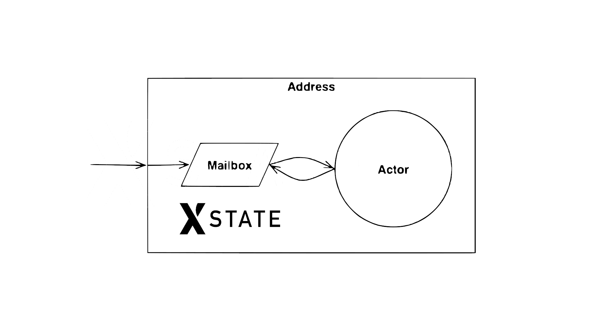

## Mailbox (Actor/XState)

A XState wrapper to implement Mailbox of Actor Model.



## Motivation

I'm building assistant chatbot for Wechaty community, and I want to use actor model based on XState to implement it.

My actor will receive message from Wechaty, and send message to Wechaty.

However, ... (describe the async & multi-user scanerio for the conversation turns)

It turns out ... (describe that we need to make sure the incoming messages are queued when we not finished processing the last one)

## Actor Mailbox Concept

In actor model, we must follow that: "if you send 3 messages to the same actor, it will just execute one at a time."

> Actors have mailboxes

```text
It’s important to understand that, although multiple actors can run at the same time, an actor will process a given message sequentially. This means that if you send 3 messages to the same actor, it will just execute one at a time. To have these 3 messages being executed concurrently, you need to create 3 actors and send one message each.

Messages are sent asynchronously to an actor, that needs to store them somewhere while it’s processing another message. The mailbox is the place where these messages are stored.
```

> &mdash; [The actor model in 10 minutes](https://www.brianstorti.com/the-actor-model/)

## Resources

- [XState Actors](https://xstate.js.org/docs/guides/actors.html#actor-api)

## History

### main

### v0.0.1 (Dec 18, 2021)

Initial version.

Related issue discussions:

- [respond only work when it's in the first state that receiving the EVENT xstate/issues#2861](https://github.com/statelyai/xstate/issues/2861)
- [Actor model needs a Mailbox wrapper/concurrency-manager wechaty/bot5-assistant#4](https://github.com/wechaty/bot5-assistant/issues/4)
- [Discord Actor Model discussion](https://discord.com/channels/795785288994652170/800812250306183178/917329930294009877)
- [Kotlin Concurrency with Actors, Jag Saund, Jun 14, 2018](https://medium.com/@jagsaund/kotlin-concurrency-with-actors-34bd12531182)
- [xstate-onentry-timing-bug.js](https://github.com/statelyai/xstate/issues/370#issuecomment-465954271)
- [[v5] Optimize mailbox statelyai/xstate#2870](https://github.com/statelyai/xstate/issues/2870)

## Author

[Huan LI](https://github.com/huan) ([李卓桓](http://linkedin.com/in/zixia)), Author of Wechaty, [Microsoft Regional Director](https://rd.microsoft.com/en-us/huan-li), zixia@zixia.net

[](https://stackexchange.com/users/265499)

## Copyright & License

- Docs released under Creative Commons
- Code released under the Apache-2.0 License
- Code & Docs © 2021 Huan LI \<zixia@zixia.net\>
